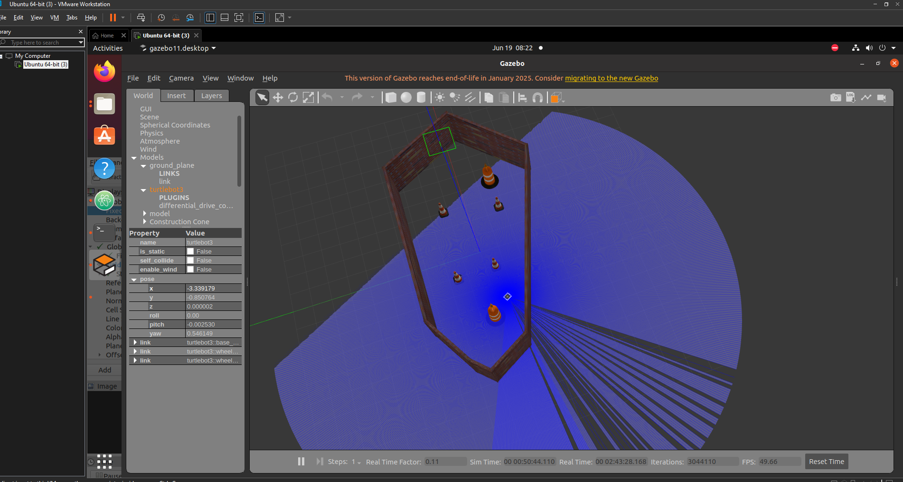
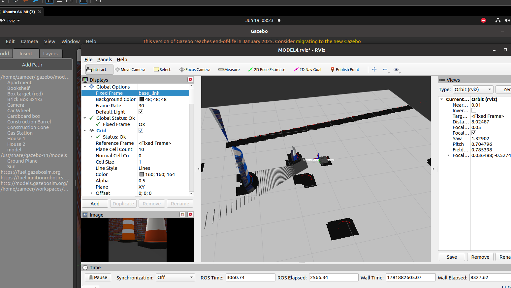
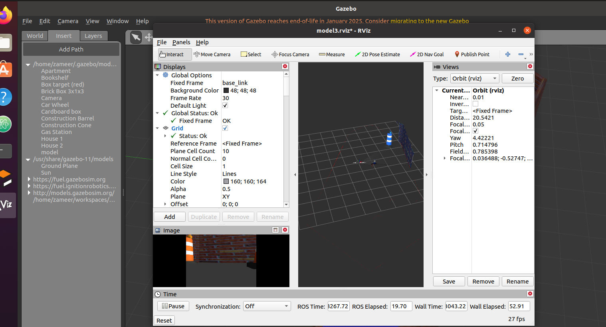
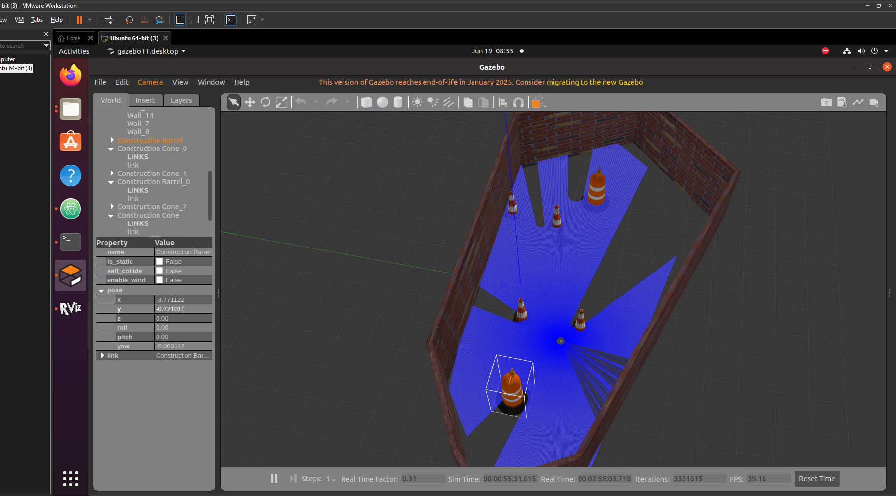

# ROS Obstacle Avoidance Navigation

Autonomous obstacle avoidance and goal-based navigation for TurtleBot3 using ROS, Gazebo, RViz, Occupancy Grid Mapping, A* Path Planning, and Path Following.

---

## Project Overview

This project implements a complete autonomous navigation pipeline for TurtleBot3 in a simulated Gazebo environment.

The robot receives a navigation goal, detects obstacles using LiDAR, generates an occupancy grid map, plans a path using A* search, and follows the generated path until reaching the target location.

The objective of this project is to demonstrate fundamental robotics concepts including:

* Autonomous Navigation
* Occupancy Grid Mapping
* Obstacle Detection
* Path Planning
* Path Following
* ROS Node Communication
* Gazebo Simulation
* RViz Visualization

---

## Features

* Real-time LiDAR obstacle detection
* Occupancy grid map generation
* A* path planning
* Goal-based navigation
* Path following controller
* Pure Pursuit controller
* Dynamic path replanning
* Goal reached detection
* Odometry tracking
* Gazebo simulation environment
* RViz visualization

---

## System Architecture

```text
LiDAR Scan
     |
     v
Occupancy Grid Builder
     |
     v
Occupancy Grid Map
     |
     v
A* Planner
     |
     v
Planned Path
     |
     v
Path Follower
     |
     v
Pure Pursuit Controller
     |
     v
Velocity Commands
     |
     v
TurtleBot3

Goal Manager ---------> Goal

Odometry Tracker <----- Odometry

Goal Reached Manager <----- Goal + Odometry

Dynamic Replanner <----- Map + Goal + Odometry
```

---

## Implemented ROS Nodes

### Occupancy Grid Builder

**Purpose**

Generates a 2D occupancy grid map from LiDAR scan data.

**Subscribed Topics**

* `/scan`

**Published Topics**

* `/occupancy_grid`

---

### Goal Manager

**Purpose**

Handles navigation goal generation and management.

**Published Topics**

* `/goal`

---

### A* Planner

**Purpose**

Plans a path from the robot position to the target goal while avoiding detected obstacles.

**Subscribed Topics**

* `/occupancy_grid`
* `/goal`
* `/odom`

**Published Topics**

* `/planned_path`

---

### Path Follower

**Purpose**

Converts the planned path into velocity commands for navigation.

**Subscribed Topics**

* `/planned_path`
* `/odom`

**Published Topics**

* `/cmd_vel`

---

### Pure Pursuit Controller

**Purpose**

Provides smooth path tracking using the Pure Pursuit algorithm.

**Subscribed Topics**

* `/planned_path`
* `/odom`

**Published Topics**

* `/cmd_vel`

---

### Odometry Tracker

**Purpose**

Tracks the robot pose and odometry information.

**Subscribed Topics**

* `/odom`

---

### Goal Reached Manager

**Purpose**

Detects when the robot reaches the target goal.

**Subscribed Topics**

* `/odom`
* `/goal`

**Published Topics**

* `/goal_reached`

---

### Dynamic Replanner

**Purpose**

Triggers replanning when navigation conditions change.

**Subscribed Topics**

* `/occupancy_grid`
* `/goal`
* `/odom`

**Published Topics**

* `/planned_path`

---

## ROS Topics

| Topic | Message Type | Description |
|---------|---------|---------|
| /scan | sensor_msgs/LaserScan | LiDAR scan data |
| /occupancy_grid | nav_msgs/OccupancyGrid | Generated occupancy map |
| /goal | geometry_msgs/PoseStamped | Navigation goal |
| /planned_path | nav_msgs/Path | Planned path |
| /cmd_vel | geometry_msgs/Twist | Robot velocity commands |
| /odom | nav_msgs/Odometry | Robot odometry |
| /goal_reached | std_msgs/Bool | Goal completion status |

---

## Software Stack

* ROS Noetic
* Gazebo
* RViz
* TurtleBot3
* C++
* Occupancy Grid Mapping
* A* Search Algorithm
* Pure Pursuit Controller
* Differential Drive Control

---

## Project Structure

```text
turtlebot3_description
│
├── launch
│   ├── obstacle_detection.launch
│
├── src
│   ├── occupancy_grid_builder.cpp
│   ├── goal_manager.cpp
│   ├── astar_planner.cpp
│   ├── path_follower.cpp
│   ├── pure_pursuit_controller.cpp
│   ├── odometry_tracker.cpp
│   ├── goal_reached_manager.cpp
│   └── dynamic_replanner.cpp
│
├── urdf
│
├── meshes
│
├── rviz
│
├── CMakeLists.txt
│
└── package.xml
```

---

## Running the Project

### Build Workspace

```bash
cd ~/workspaces/Udemy_Ws

catkin_make

source devel/setup.bash
```

### Launch Simulation

```bash
roslaunch turtlebot3_description obstacle_detection.launch
```

### Publish Navigation Goal

```bash
rostopic pub -1 /goal geometry_msgs/PoseStamped "
header:
  frame_id: 'base_link'
pose:
  position:
    x: 3.0
    y: 2.0
    z: 0.0
  orientation:
    w: 1.0"
```

---

## Simulation Results

<p align="center">
  
</p>

<p align="center">
  
</p>

<p align="center">
  
</p>

<p align="center">
  
</p>

---

## Future Improvements

* Dynamic obstacle avoidance
* Dijkstra path planning
* RRT path planning
* SLAM integration
* Real TurtleBot3 deployment
* RGB-D camera integration
* Multi-obstacle navigation
* Navigation in large-scale environments

---

## Learning Outcomes

Through this project, the following robotics concepts were implemented and tested:

* ROS Publisher/Subscriber communication
* Occupancy Grid Mapping
* A* Path Planning
* Pure Pursuit Path Tracking
* Autonomous Navigation
* Dynamic Replanning
* Robot Motion Control
* Gazebo Simulation
* RViz Visualization
* Mobile Robot Software Development

---

## Author

**Zameer Hussain**

M.Eng Robotics Engineering

FH schmalkalden

Robotics | ROS | Autonomous Navigation | Computer Vision
